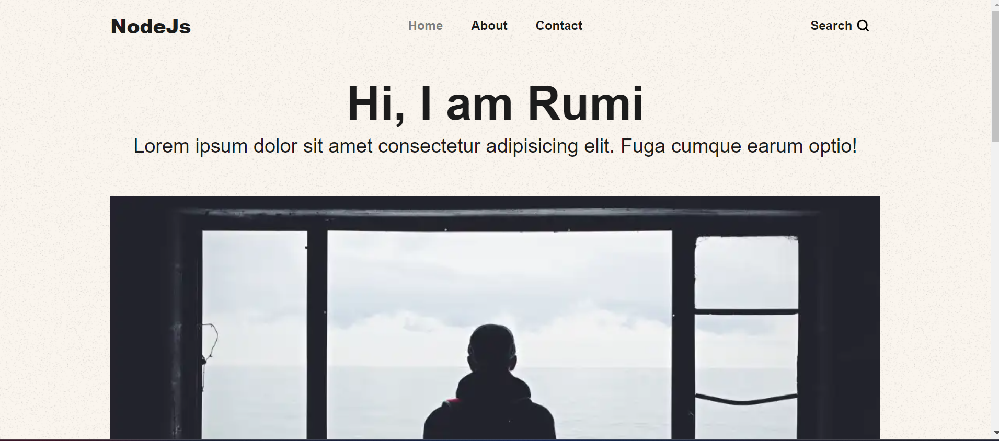

# Blog Website

### Tech Stack

* EJS
* NodeJS
* Express
* MongoDB

### Installation

* Fork the repo. Clone in local desktop
* Use `npm i` to download all the dependencies
* Visit [MongoDB](https://www.mongodb.com/atlas/database "Atlas") to create a cluster and make sure to remember the password
* Create a .env file to store the `MongoDB URI` and `JWT Token`
* Run the command : `nodemon app.js` which will deploy the server at `localhost:5000`
